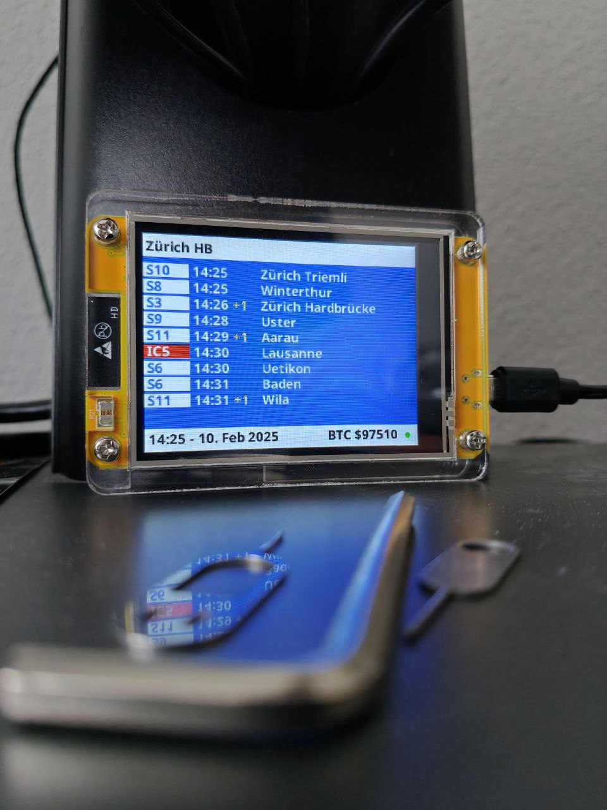

# StationBoard

## Your next departure, at a glance

StationBoard is a small, always-on Swiss public transport display for your home, office, or workshop. It puts the departures you actually care about on a dedicated screen, so checking when to leave does not require unlocking your phone, opening an app, or navigating a timetable.

<p align="center">
  
</p>

<p align="center">
  <a href="https://github.com/pashol/Stationboard/releases/latest"></a>
  <a href="LICENSE"></a>
  <a href="https://github.com/pashol/Stationboard/releases/tag/1.3.0">Firmware 1.3.0</a>
</p>

<p align="center">
  <a href="https://github.com/pashol/Stationboard/releases/latest">Download firmware</a>
  &nbsp;&middot;&nbsp;
  <a href="https://stationboard-uploader.vercel.app/">Flash a device</a>
  &nbsp;&middot;&nbsp;
  <a href="#build-from-source">Build from source</a>
</p>

## The useful kind of smart display

StationBoard is deliberately focused: one glance, the information you need, no notifications and no subscription.

| Glanceable | Flexible | Resilient |
| --- | --- | --- |
| See the next departures on a 2.8-inch display. | Configure two stations and optionally connect them with a journey view. | Keep valid departures on screen through temporary WiFi or API failures. |

### Highlights

- Real-time departures for Swiss trains, buses, trams, and boats
- Three views: Station 1, Station 2, and optional connections between them
- Configurable number of departures and stationboard time offset
- Cached data that survives transient network failures, with expired rows removed
- Five brightness levels, including a low-power sleep mode
- Configurable night mode with optional weekend disable
- Automatic Swiss time-zone handling, including daylight-saving time
- Smartphone-friendly WiFi setup without hard-coded network credentials
- Optional authenticated OTA updates for custom builds
- A small Bitcoin price ticker in the footer

## How it works

StationBoard has one button and three useful display modes. A double click cycles through the modes; the connections view is included only when enabled in the setup portal.

| View | Shows |
| --- | --- |
| Station 1 | The next departures from your primary station |
| Station 2 | The next departures from your second station |
| Connections | Available journeys from Station 1 to Station 2 |

The display refreshes transport data approximately every 60 seconds. If WiFi disappears, the last valid snapshot remains visible while the device reconnects. Departed or expired rows are removed instead of being presented as current information.

## Hardware

- **ESP32-2432S028R**, also known as the Cheap Yellow Display (CYD)
  - ESP32 WiFi microcontroller
  - 2.8-inch ILI9341-compatible TFT display
  - 320x240 landscape resolution
  - Built-in boot button used for controls
- USB power supply and cable
- 2.4 GHz WiFi network

No additional sensors, server, database, or mobile app are required.

## Get one running

### 1. Flash the firmware

The easiest route is the [StationBoard flashing page](https://stationboard-uploader.vercel.app/).

Download the three files from the [latest release](https://github.com/pashol/Stationboard/releases/latest), then flash:

- `bootloader.bin`
- `partitions.bin`
- `firmware.bin`

Connect the CYD over USB for the initial flash. After that, only USB power and WiFi are needed.

### 2. Configure your stations

1. Power on the device.
2. If WiFi has not been configured, connect to the `Stationboard_AP` access point.
3. Open the captive portal on your phone.
4. Enter your WiFi details and the names of two Swiss transport stations.
5. Optionally enable connections mode, choose the departure count, set a time offset, and configure night mode.

The configuration is stored on the device and survives restarts. The portal can be opened or closed later with a triple click.

## Button controls

| Action | Function |
| --- | --- |
| Single click | Cycle brightness levels 0-4; temporarily wake the display during night mode |
| Double click | Cycle Station 1, Station 2, and connections mode when enabled |
| Triple click | Open or close the WiFi configuration portal |
| Long press for 10 seconds | Enter authenticated OTA mode when the firmware was built with OTA credentials |

## Power and quiet hours

The five brightness levels let the display work as either an information board or a low-power ambient display. At the highest level, the ESP32 uses light sleep between refreshes. At lower levels, it runs at a reduced CPU frequency.

Night mode turns the backlight off on a configurable schedule and checks the schedule every five minutes. It can be disabled on weekends. A single click temporarily wakes the display for 30 seconds, which is useful when you need to check the board or open the portal.

## OTA updates

OTA is disabled unless both credentials are supplied at build time. The official release binaries are built without credentials. To enable authenticated OTA in a private build, set both variables without committing their values:

```powershell
$env:OTA_USERNAME = "your-ota-user"
$env:OTA_PASSWORD = "a-strong-secret"
& "$HOME\.platformio\penv\Scripts\pio.exe" run
```

Then long-press the button for 10 seconds, open `http://<device-ip>/update`, and upload the new firmware. OTA mode closes after two minutes without an upload, or after a failed or stalled update. The WiFi portal and OTA mode cannot run at the same time.

## Build from source

Install [PlatformIO](https://platformio.org/) through the CLI or the VS Code extension, clone the repository, and run the following from PowerShell:

```powershell
git clone https://github.com/pashol/Stationboard.git
cd Stationboard

# OTA is disabled unless both credentials are set
& "$HOME\.platformio\penv\Scripts\pio.exe" run

# Upload over USB
& "$HOME\.platformio\penv\Scripts\pio.exe" run -t upload

# Optional serial monitor at 115200 baud
& "$HOME\.platformio\penv\Scripts\pio.exe" device monitor
```

The firmware targets the `ESP32-2432S028R` environment and uses the OTA partition layout with two 1.5 MB application slots. Builds fail if the firmware exceeds an OTA slot.

## Project structure

<details>
<summary>Show the main firmware modules</summary>

| Module | Responsibility |
| --- | --- |
| `src/main.cpp` | Startup, refresh loop, WiFi recovery, and sleep management |
| `src/globals.h/cpp` | Configuration, constants, and shared state |
| `src/stationboard.h/cpp` | Bounded stationboard parsing and rendering |
| `src/connections.h/cpp` | Bounded connections parsing and rendering |
| `src/networking.h/cpp` | WiFiManager portal and Bitcoin price fetching |
| `src/utilities.h/cpp` | Time formatting, persistence, brightness, and night mode |
| `src/http_request.h` | Bounded HTTP responses and timeout handling |
| `src/ota.h/cpp` | Authenticated ElegantOTA handling |

The parser uses fixed-capacity ArduinoJson documents and bounded HTTP streams to keep memory use predictable on an ESP32 without PSRAM.

</details>

## APIs and libraries

- [Swiss Transport API](https://transport.opendata.ch/) for stationboards and connections
- [Coinbase price API](https://docs.cloud.coinbase.com/sign-in-with-coinbase/docs/api-prices) for the optional BTC ticker
- [TFT_eSPI](https://github.com/Bodmer/TFT_eSPI) for the display
- [ArduinoJson](https://arduinojson.org/) for bounded JSON parsing
- [WiFiManager](https://github.com/tzapu/WiFiManager) for the captive portal
- [ElegantOTA](https://github.com/ayushsharma82/ElegantOTA) for authenticated firmware updates
- [Timezone](https://github.com/JChristensen/Timezone) for Swiss daylight-saving time

## Roadmap

- [x] Second station support
- [x] Connections mode between Station 1 and Station 2
- [x] Authenticated OTA firmware updates
- [x] Configurable night mode
- [x] Offline and stale-data handling
- [ ] OTA over the internet

## License

StationBoard is released under the [GNU General Public License v3.0](LICENSE).

## Acknowledgments

Thanks to the [Swiss Transport API](https://transport.opendata.ch/), the ESP32 and Arduino communities, and everyone building small tools that make daily life a little easier.
